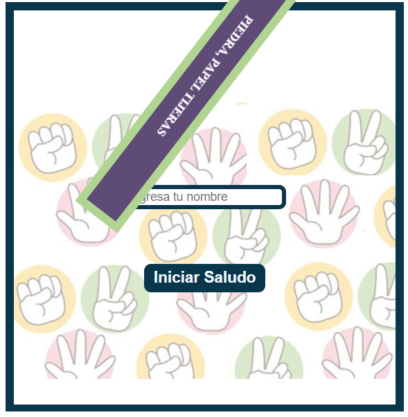

# Getting Started with Create React App

This project was bootstrapped with [Create React App](https://github.com/facebook/create-react-app).

## Available Scripts

In the project directory, you can run:

### `npm start`

Runs the app in the development mode.\
Open [https://vale-78.github.io/React-PiedPapelTijeras/](https://vale-78.github.io/React-PiedPapelTijeras/) to view it in your browser.

The page will reload when you make changes.\
You may also see any lint errors in the console.

### `npm test`

Launches the test runner in the interactive watch mode.\
See the section about [running tests](https://facebook.github.io/create-react-app/docs/running-tests) for more information.

### `npm run build`

Builds the app for production to the `build` folder.\
It correctly bundles React in production mode and optimizes the build for the best performance.

The build is minified and the filenames include the hashes.\
Your app is ready to be deployed!


## PIEDRA-PAPEL-TIJERAS con componentes en REACT

#### AUTOR: Inés Valeria Foglino

#### Ejecuta la aplicación en modo de desarrollo:
Abre [https://vale-78.github.io/React-PiedPapelTijeras/](https://vale-78.github.io/React-PiedPapelTijeras/) para ver en tu navegador.
### Herramientas
Este proyecto integra JSX y CSS en REACT. 

### Características

Aquí podrás divertirte jugando a Piedra Papel y tijeras contra tu PC.

* Gana el mejor de 5 jugadas.
* Por tanto, el que gana 3 jugadas, es el campeón.
* Los empates no se cuentan como partidos jugados.


### Casos de prueba:

##### Animación de título
Al colocar el mouse sobre el título, observarás una dinámica animacíon (Rotación y cambio de colores)


##### Ingreso del nombre de usuario
Es necesario completar esta entrada para acceder al saludo y así habilitar el botón "Iniciar Juego".


En caso de no completarlo, aparece mensaje: "Ingresa un nombre válido".
   


Al colocar el usuario su "Nombre", aparece el siguiente saludo: "Bienvenida/o  nombre!,  Si estás lista/o para comenzar, inicia Juego!".


##### Habilitación al clickear el botón "Iniciar Juego"
Una vez concretado el saludo, se habilita el botón para Iniciar juego!!
Haciendo "click" al botón "Iniciar Juego", se habilitan botones para seleccionar Jugada:
* Piedra.
* Papel.
* Tijeras.


##### Grilla de conteo de Resultados
Cada vez que el usuario selecciona una opción de juego debajo se observa: 
* Elección de Usuario
* Elección de Computador
* Puntos de Juego de cada uno de los jugadores.
* Resultado de cada ronda.


##### Resultado final
Luego que ganó uno de los jugadores, aparece un mensaje de resultado final correspondiente al mejor de 5 jugadas.
Cabe destacar que se felicita al usuario con su "nombre" ingresado al inicio.


### Algoritmo principal.
```javascript

    (...)
function determinarGanador(eleccionJugador, jugadaCompu){
    
    if(ganaPC < 3 && ganaUsuario < 3) { 
    const resultadoRondaParrafo = document.getElementById("resultadoRonda");
    let numGanaUsuario = document.getElementById("numeroGanaUsuario");
    let numGanaPC = document.getElementById("numeroGanaPC");
        
        if(eleccionJugador==jugadaCompu){
            resultado = "Empate";
            resultadoRondaParrafo.innerHTML = resultado;
            numGanaUsuario.innerHTML = ganaUsuario;
            numGanaPC.innerHTML= ganaPC;            
        }else if((eleccionJugador==piedra && jugadaCompu ==tijeras) || (eleccionJugador==papel && jugadaCompu == piedra ) || (eleccionJugador==tijeras && jugadaCompu == papel)){
            partidosJugados = partidosJugados +1;
            console.log(partidosJugados);
            ganaUsuario = ganaUsuario +1;
            resultado = "Ganaste!!!";
            resultadoRondaParrafo.innerHTML = resultado;
            numGanaUsuario.innerHTML = ganaUsuario;
            numGanaPC.innerHTML= ganaPC;
        }else{
            resultado = "Gana la computadora";
            partidosJugados = partidosJugados +1;
            console.log(partidosJugados);
            ganaPC = ganaPC +1;
            resultadoRondaParrafo.innerHTML = resultado;
            numGanaUsuario.innerHTML = ganaUsuario;
            numGanaPC.innerHTML= ganaPC;
        }  
  
    } if(ganaPC == 3 || ganaUsuario == 3) {
        let usuGana= ganaUsuario;
        let compuGana= ganaPC
        resultadoFinalfin( usuGana, compuGana);
    }
}
(...)

```

### Cómo correr la aplicación _"Piedra, papel y tijeras"_?

Para ejecutar esta aplicación, simplemente se necesita clonar el proyecto y ejecutar el archivo html.
Sino, accede directamente desde aquí:
    [GitHub Pages]( https://vale-78.github.io/Piedra-Papel-Tijeras/).


### Contribuciones

Cualquier tipo de aportes son bienvenidos.

1. <a href='https://help.github.com/articles/fork-a-repo/'>**(Fork)**</a> Bifurque el repositorio en GitHub.
2. <a href='https://help.github.com/articles/cloning-a-repository/'>**(Clone)**</a> Clone el proyecto en su propia máquina.
3. <a href='https://git-scm.com/book/en/v2/Git-Basics-Recording-Changes-to-the-Repository'>**(Commit)**</a> Confirmar cambios en la rama de desarrollo. <a href='https://git-scm.com/book/en/v2/Git-Branching-Branches-in-a-Nutshell'>**(development branch)**</a>.
4. <a href='https://help.github.com/articles/pushing-to-a-remote/'>**(Push)**</a> Empuje su trabajo de regreso a su repositorio en git.
5. <a href='https://help.github.com/articles/about-pull-requests/'>**(Pull request)**</a> Envíe una solicitud de extracción para que pueda revisar sus cambios. 