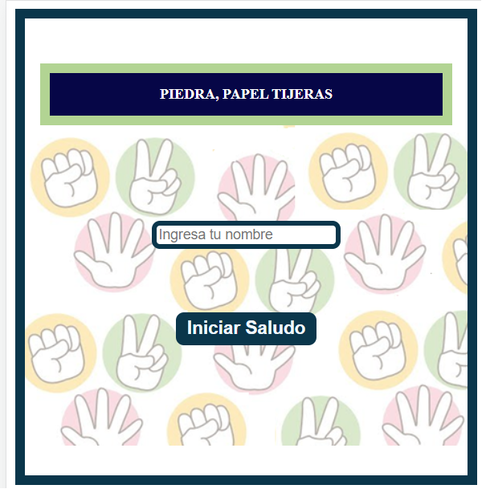
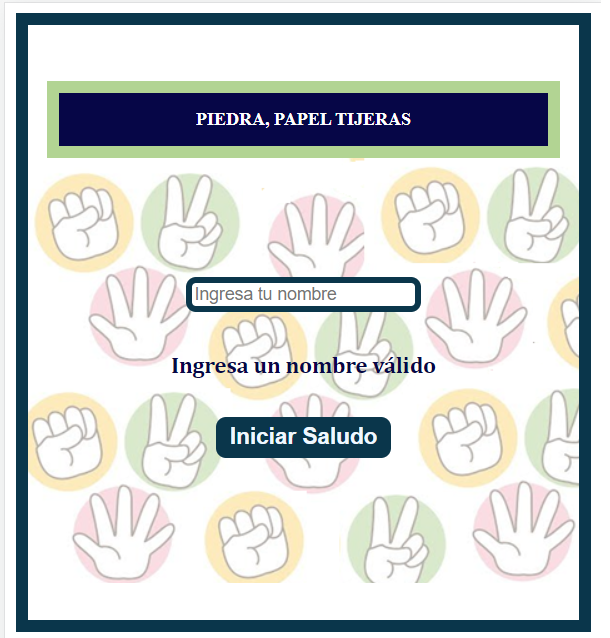
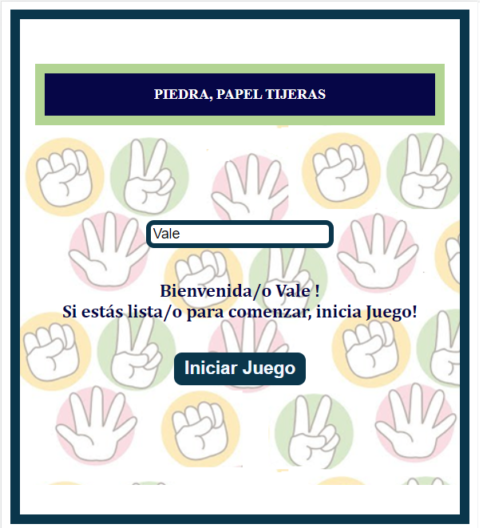
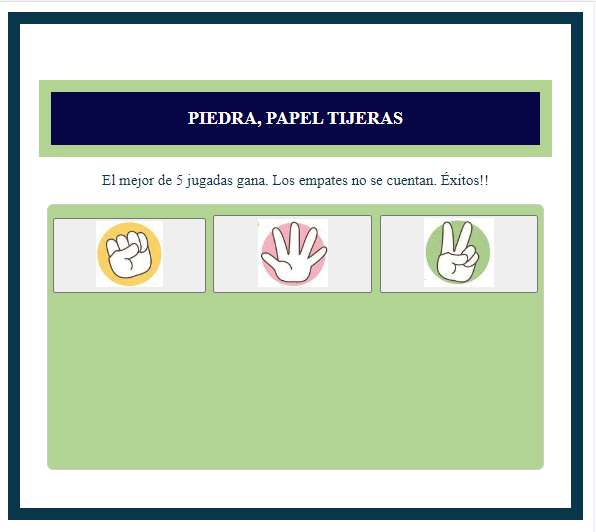
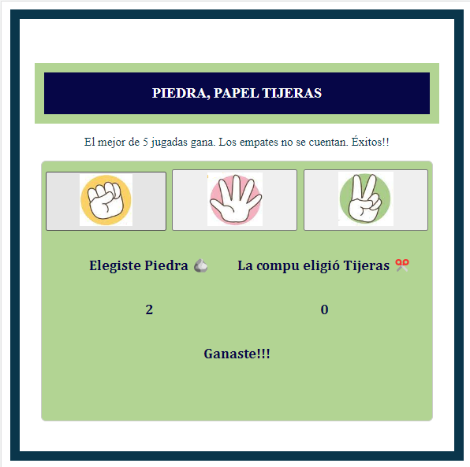
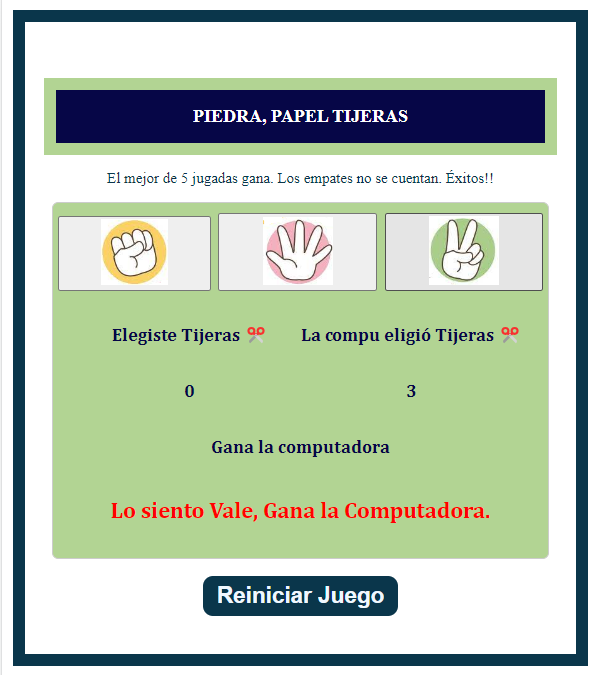

## PIEDRA-PAPEL-TIJERAS con componentes en REACT

#### AUTOR: Inés Valeria Foglino

#### Ejecuta la aplicación en modo de desarrollo:
Abre el juego [Piedra, Papel, Tijeras](https://vale-78.github.io/React-PiedPapelTijeras/) para ver y competir en tu navegador.
### Herramientas

Este proyecto fue iniciado con [Create React App](https://github.com/facebook/create-react-app) e integra JSX y CSS. 

### Características

Aquí podrás divertirte jugando a Piedra Papel y tijeras contra tu PC.

* Gana el mejor de 5 jugadas.
* Por tanto, el que gana 3 jugadas, es el campeón.
* Los empates no se cuentan como partidos jugados.


### Casos de prueba:

##### Ingreso del nombre de usuario
Es necesario completar esta entrada para acceder al saludo y así habilitar el botón "Iniciar Juego".


En caso de no completarlo, aparece mensaje: "Ingresa un nombre válido".
   


Al colocar el usuario su "Nombre", aparece el siguiente saludo: "Bienvenida/o  nombre!,  Si estás lista/o para comenzar, inicia Juego!".


##### Habilitación al clickear el botón "Iniciar Juego"
Una vez concretado el saludo, se habilita el botón para Iniciar juego!!
Haciendo "click" al botón "Iniciar Juego", se habilitan botones para seleccionar Jugada:
* Piedra.
* Papel.
* Tijeras.




##### Grilla de conteo de Resultados
Cada vez que el usuario selecciona una opción de juego debajo se observa: 
* Elección de Usuario
* Elección de Computador
* Puntos de Juego de cada uno de los jugadores.
* Resultado de cada ronda.



##### Resultado final
Luego que ganó uno de los jugadores, aparece un mensaje de resultado final correspondiente al mejor de 5 jugadas.
Cabe destacar que se felicita al usuario con su "nombre" ingresado al inicio.



###  Usando HOOKS:
##### useState
El hook useState es una de las herramientas más fundamentales en React para manejar el estado en una aplicación. Es una forma sencilla de crear y actualizar variables de estado en un componente de React sin tener que escribir una clase completa.

##### useEffect
En React, useEffect es un gancho que le permite realizar efectos secundarios en un componente funcional. Los efectos secundarios son operaciones que ocurren fuera del flujo normal de la representación del componente, como obtener datos de una API, configurar suscripciones o modificar el DOM.
### Algoritmo principal, implementando useState y useEffect
```jsx
import React from "react";
import { Botones } from "./Botones";
import { useState, useEffect } from "react";

function Juego({ puntajes, setPuntajes, mensaje, setMensaje, resultParcial, setResultParcial}) {
  const [ganador, setGanador] = useState("");

  function DeterminarGanador() {
    if (puntajes.jugador === 3) {
      setGanador("jugador");
      setMensaje("Felicitaciones, Ganaste!!!");
    } else if (puntajes.computadora === 3) {
      setGanador("computadora");
      setMensaje("Lo siento, Gana la computadora");
    }
  }
  useEffect(() => {
    DeterminarGanador(puntajes);
  });
  return (
    <div>
      <Botones tipo="piedra" puntajes={puntajes} setPuntajes={setPuntajes} ganador={ganador} resultParcial={resultParcial} setResultParcial={setResultParcial}/>
      <Botones tipo="papel" puntajes={puntajes} setPuntajes={setPuntajes} resultParcial={resultParcial} setResultParcial={setResultParcial}/>
      <Botones tipo="tijeras" puntajes={puntajes} setPuntajes={setPuntajes} resultParcial={resultParcial} setResultParcial={setResultParcial} />
    </div>
  );
}
export { Juego };
    (...)

(...)

```

### Cómo correr la aplicación _"Piedra, papel y tijeras"_?

Para ejecutar esta aplicación, simplemente se necesita clonar el proyecto [AQUÍ ](https://github.com/Vale-78/React-PiedPapelTijeras) y ejecutar el archivo, desde tu terminal, con el comando: _npm start_.
Sino, accede directamente desde aquí: [Piedra, Papel, Tijeras](https://vale-78.github.io/React-PiedPapelTijeras/) para ver y competir en tu navegador.


### Contribuciones

Cualquier tipo de aportes son bienvenidos.

1. <a href='https://help.github.com/articles/fork-a-repo/'>**(Fork)**</a> Bifurque el repositorio en GitHub.
2. <a href='https://help.github.com/articles/cloning-a-repository/'>**(Clone)**</a> Clone el proyecto en su propia máquina.
3. <a href='https://git-scm.com/book/en/v2/Git-Basics-Recording-Changes-to-the-Repository'>**(Commit)**</a> Confirmar cambios en la rama de desarrollo. <a href='https://git-scm.com/book/en/v2/Git-Branching-Branches-in-a-Nutshell'>**(development branch)**</a>.
4. <a href='https://help.github.com/articles/pushing-to-a-remote/'>**(Push)**</a> Empuje su trabajo de regreso a su repositorio en git.
5. <a href='https://help.github.com/articles/about-pull-requests/'>**(Pull request)**</a> Envíe una solicitud de extracción para que pueda revisar sus cambios. 